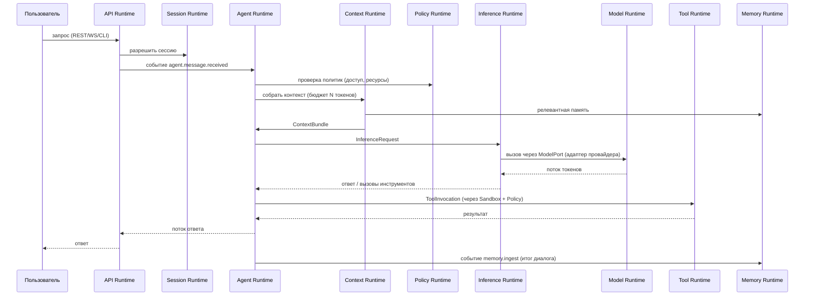
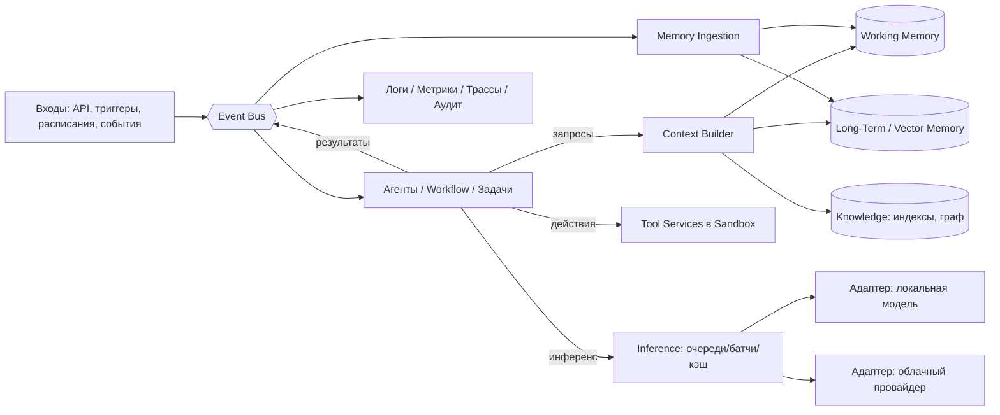

# 00 — Обзор архитектуры AgentOS

## 1. Миссия

AgentOS — универсальная программная платформа, являющаяся **операционной
средой для искусственного интеллекта**. Платформа не зависит от конкретной
модели, поставщика или технологии: любая языковая модель рассматривается
как сменяемый вычислительный модуль.

Платформа обеспечивает полный жизненный цикл интеллектуальных систем:
управление моделями, памятью, контекстом; выполнение задач; координацию
агентов; работу с инструментами; управление знаниями; безопасность;
наблюдаемость; расширяемость.

Целевые классы систем поверх AgentOS: персональные ассистенты,
корпоративные AI-системы, исследовательские платформы, IDE с ИИ,
автономные агенты, мультиагентные среды.

## 2. Архитектурные принципы

| Принцип | Как применяется |
|---|---|
| Clean Architecture | Домен не зависит от инфраструктуры; зависимости направлены внутрь |
| SOLID | Каждый Runtime и компонент имеет единственную ответственность; расширение — без модификации |
| Hexagonal Architecture | Каждый Runtime общается с миром через Ports (интерфейсы) и Adapters (реализации) |
| Event Driven Architecture | Межмодульное взаимодействие — только через Event Bus |
| Domain Driven Design | Каждый Runtime — bounded context со своим языком и моделью |
| Microkernel | Ядро минимально; вся функциональность — сменные модули |
| Actor Model | Агенты, задачи и воркеры — акторы с изолированным состоянием и почтовыми ящиками |
| Message Bus | Единая шина: команды, события, запросы/ответы |
| Dependency Injection | Ядро владеет контейнером; модули объявляют зависимости декларативно |
| Plugin Architecture | Любая возможность добавляется как расширение с манифестом |
| Modular Monolith → Microservices | Один процесс по умолчанию; любой Runtime выносится в отдельный сервис без изменения контрактов |
| API First / Interface First | Контракты (интерфейсы, схемы событий, API) проектируются и версионируются раньше реализации |

**Два жёстких правила:**

1. Каждый компонент имеет единственную ответственность.
2. Любой модуль заменяется без изменения остальной системы.

## 3. Слоистая модель

Runtime-модули сгруппированы в слои. Слой может зависеть только от
контрактов нижележащих слоёв; горизонтальные связи — только через события.

```mermaid
graph TB
    subgraph L5["Интерфейсный слой"]
        API[API Runtime]
        PLG[Plugin Runtime]
        EXT[Extension Runtime]
        DASH[Runtime Dashboard]
    end

    subgraph L4["Слой интеллекта"]
        AGT[Agent Runtime]
        MDL[Model Runtime]
        INF[Inference Runtime]
        TOOL[Tool Runtime]
    end

    subgraph L3["Слой исполнения"]
        TASK[Task Runtime]
        WF[Workflow Runtime]
        SCH[Scheduler Runtime]
    end

    subgraph L2["Когнитивный слой"]
        SES[Session Runtime]
        CTX[Context Runtime]
        MEM[Memory Runtime]
        KNW[Knowledge Runtime]
    end

    subgraph L1["Слой управления"]
        POL[Policy Runtime]
        SEC[Security Runtime]
        RES[Resource Runtime]
    end

    subgraph L0["Платформенный слой"]
        EVT[Event Runtime]
        STO[Storage Runtime]
        CFG[Configuration Runtime]
        OBS[Observability Runtime]
        MET[Metrics Runtime]
        DIA[Diagnostics Runtime]
    end

    subgraph CORE["Микроядро"]
        KRN[Core Runtime]
    end

    L5 --> L4 --> L3 --> L2
    L2 --> L1
    L1 --> L0
    L0 --> CORE
```



## 4. Карта Runtime-модулей

| Runtime | Слой | Единственная ответственность |
|---|---|---|
| Core | Микроядро | Запуск, жизненный цикл модулей, DI, реестр сервисов, загрузка конфигурации, маршрутизация сообщений |
| Event | Платформенный | Шина событий: публикация, подписка, маршрутизация, приоритеты, история |
| Storage | Платформенный | Единый доступ к хранилищам (KV, реляционным, векторным, объектным, графовым) |
| Configuration | Платформенный | Источники конфигурации, схемы, валидация, hot-reload |
| Observability | Платформенный | Логи, трассировка, health checks, профилирование, алерты |
| Metrics | Платформенный | Сбор, агрегация и экспорт метрик |
| Diagnostics | Платформенный | Самодиагностика, дампы состояния, анализ инцидентов |
| Policy | Управление | Декларативные политики: доступ, ресурсы, модели, память, контекст |
| Security | Управление | Sandbox, permissions, secrets, аудит, изоляция плагинов, обнаружение угроз |
| Resource | Управление | Бюджеты CPU/GPU/RAM/VRAM/сети/токенов/контекстного окна; оптимизация |
| Session | Когнитивный | Жизненный цикл сессий пользователей и агентов |
| Context | Когнитивный | Автоматическая сборка контекста из всех источников под бюджет |
| Memory | Когнитивный | Многоуровневая память и жизненный цикл данных в ней |
| Knowledge | Когнитивный | Знания: RAG, индексы, эмбеддинги, граф знаний, доверие, версии |
| Task | Исполнение | Атомарные задачи: состояние, повтор, результат |
| Workflow | Исполнение | Оркестрация: последовательности, ветвления, циклы, компенсации |
| Scheduler | Исполнение | Планирование: таймеры, очереди, зависимости, фоновые задачи |
| Agent | Интеллект | Композиция и исполнение агентов (акторов) из независимых компонентов |
| Model | Интеллект | Реестр моделей и единый интерфейс к любым провайдерам |
| Inference | Интеллект | Исполнение запросов к моделям: очереди, стриминг, батчинг, ретраи, кэш |
| Tool | Интеллект | Инструменты как сервисы: манифесты, права, версии, метрики |
| API | Интерфейсный | Внешние протоколы: REST, gRPC, WebSocket, CLI, SDK |
| Plugin | Интерфейсный | Загрузка, изоляция и жизненный цикл плагинов |
| Extension | Интерфейсный | Точки расширения: драйверы, адаптеры, коннекторы, SDK |

## 5. Сквозной поток: запрос пользователя



Каждый шаг публикует события в Event Runtime; Observability и Metrics
подписаны на них пассивно — наблюдаемость не требует инструментирования
бизнес-логики.

## 6. Поток данных (высокий уровень)



## 7. Правила взаимодействия модулей

1. **События — по умолчанию.** Всё асинхронное взаимодействие — через
   Event Runtime (publish/subscribe, at-least-once, идемпотентные
   обработчики).
2. **Порты — для синхронных запросов.** Когда нужен ответ «здесь и
   сейчас» (сборка контекста, проверка политики), модуль вызывает порт
   (интерфейс), зарегистрированный в Service Registry ядра. Вызов через
   порт прозрачен для локального и удалённого размещения модуля
   (in-process call или RPC — решает транспортный адаптер).
3. **Никаких прямых импортов чужой реализации.** Модуль видит только
   пакеты контрактов (`contracts/*`) других модулей.
4. **Схемы версионируются.** Все события и порты имеют semver-версию;
   изменения — только обратно совместимые в пределах major-версии.

## 8. Структура модуля (гексагональный шаблон)

Каждый Runtime устроен одинаково:

```
runtime-<name>/
  contracts/        # Ports: интерфейсы, DTO, схемы событий (публичные)
  domain/           # Чистая доменная модель, без зависимостей
  application/      # Use cases, обработчики команд/событий
  adapters/
    inbound/        # Event handlers, RPC handlers
    outbound/       # Реализации внешних портов (БД, провайдеры, ОС)
  module.manifest.yaml   # Манифест модуля для ядра
```

`module.manifest.yaml` объявляет: имя, версию, предоставляемые порты,
требуемые порты, публикуемые/потребляемые события, параметры конфигурации,
требуемые разрешения.

## 9. Эволюция: Modular Monolith → Microservices

- **Фаза A (по умолчанию):** один процесс, все Runtime — модули in-process,
  Event Bus — внутренняя очередь, порты — прямые вызовы.
- **Фаза B:** тяжёлые Runtime (Inference, Knowledge indexing) выносятся в
  отдельные процессы; Event Bus — брокер (NATS/Kafka-класс), порты — gRPC.
- **Фаза C:** кластер, шардирование агентов по акторной модели,
  распределённый Scheduler, репликация Storage.

Переходы не меняют контракты — меняются только транспортные адаптеры,
которые выбирает ядро по конфигурации. Подробнее: [08 — Масштабируемость](08-scalability.md).
