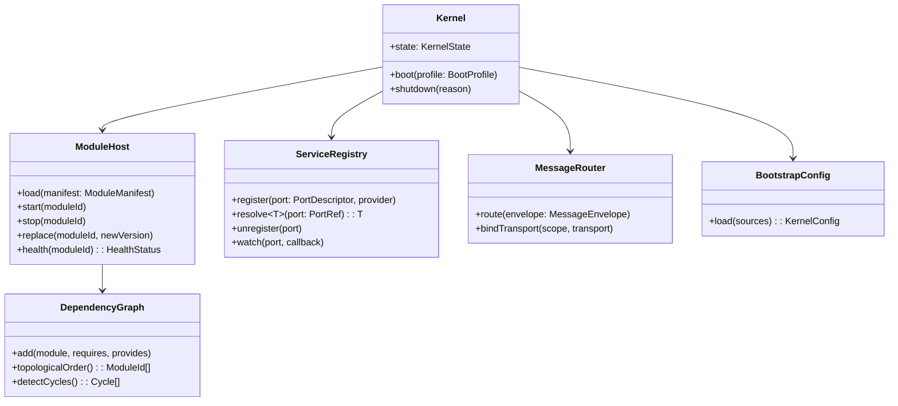
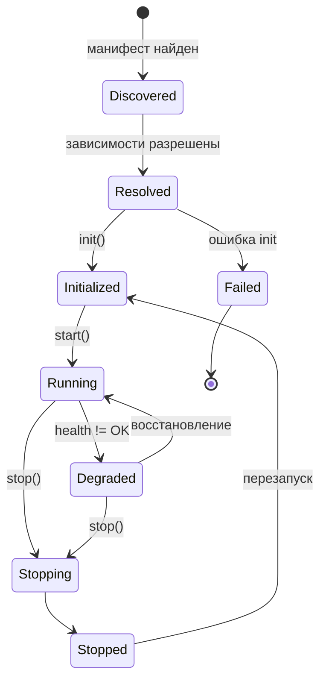
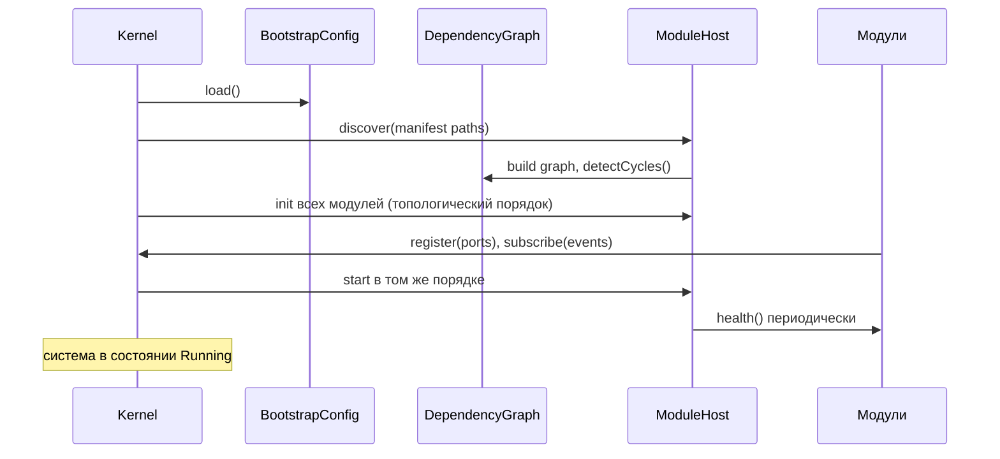

# 01 — Core Runtime (Микроядро)

## 1. Ответственность

Core Runtime — минимальное ядро платформы. Оно отвечает **только** за:

1. запуск системы (bootstrap);
2. управление жизненным циклом модулей;
3. регистрацию сервисов (Service Registry);
4. управление зависимостями (DI-контейнер);
5. маршрутизацию сообщений (Message Router — транспортный уровень шины);
6. загрузку конфигурации (bootstrap-конфигурация до старта Configuration Runtime).

Ядро **не содержит** бизнес-логики, не знает про агентов, модели, память
и знания. Всё это — модули. Целевой размер ядра — единицы тысяч строк.

## 2. Компоненты ядра



### 2.1 Kernel

Точка входа. Читает bootstrap-конфигурацию, строит DI-контейнер, находит
манифесты модулей, запускает их в топологическом порядке зависимостей.

### 2.2 ModuleHost — жизненный цикл модулей

Каждый модуль реализует контракт:

```
interface RuntimeModule {
  manifest(): ModuleManifest
  init(ctx: ModuleContext): void      // регистрация портов, подписок
  start(): Promise<void>              // начало обработки
  stop(deadline: Duration): Promise<void>  // graceful shutdown
  health(): HealthStatus              // liveness/readiness
}
```

Состояния модуля:



Горячая замена: `replace()` поднимает новую версию модуля рядом,
переключает Service Registry на новые порты, дренирует старую версию,
останавливает её. Возможна благодаря правилу «взаимодействие только через
порты и события».

### 2.3 ServiceRegistry

Реестр портов: модуль публикует реализации своих портов
(`ContextPort@1`, `PolicyPort@2`, ...), потребители получают их через
DI по декларации `requires` в манифесте. Реестр поддерживает
семантическое версионирование и `watch` — уведомление о замене
провайдера (для hot-swap).

### 2.4 MessageRouter

Транспортный примитив для Event Runtime и RPC между модулями:
доставляет `MessageEnvelope` (id, type, source, target/topic, headers,
payload, traceContext) локально (in-process) или удалённо (адаптер
брокера/gRPC). Семантика подписок, приоритетов и истории — в Event
Runtime; ядро лишь маршрутизирует.

### 2.5 BootstrapConfig

Минимальный загрузчик: файлы + переменные окружения + флаги. Отвечает на
вопросы «какие модули грузить», «какие транспорты использовать»,
«где искать плагины». Полноценная конфигурация с hot-reload — задача
Configuration Runtime.

## 3. Последовательность запуска



Остановка — в обратном порядке, с дедлайном на модуль; события в полёте
дренируются Event Runtime.

## 4. Манифест модуля

```yaml
module:
  id: memory-runtime
  version: 1.4.0
  provides:
    ports: [MemoryPort@1, MemoryAdminPort@1]
    events: [memory.item.stored@1, memory.item.promoted@1]
  requires:
    ports: [StoragePort@1, EventPort@1, PolicyPort@1]
    events: [session.closed@1, agent.turn.completed@1]
  config:
    schema: memory-runtime.schema.json
  permissions:
    - storage:vector:read-write
    - storage:kv:read-write
```

Ядро отказывает в запуске модулю, чьи требования не удовлетворены или
чьи permissions не одобрены Security Runtime.

## 5. Анализ

- **Масштабируемость:** ядро не хранит состояние выполнения — только
  топологию модулей; в кластере на каждом узле своё ядро, координация —
  на уровне модулей (Scheduler/Event).
- **Безопасность:** ядро — доверенная вычислительная база (TCB);
  минимальный размер сокращает поверхность атаки; permissions модулей
  проверяются до старта.
- **Расширяемость:** новая функциональность никогда не добавляется в
  ядро — только новым модулем или расширением.
