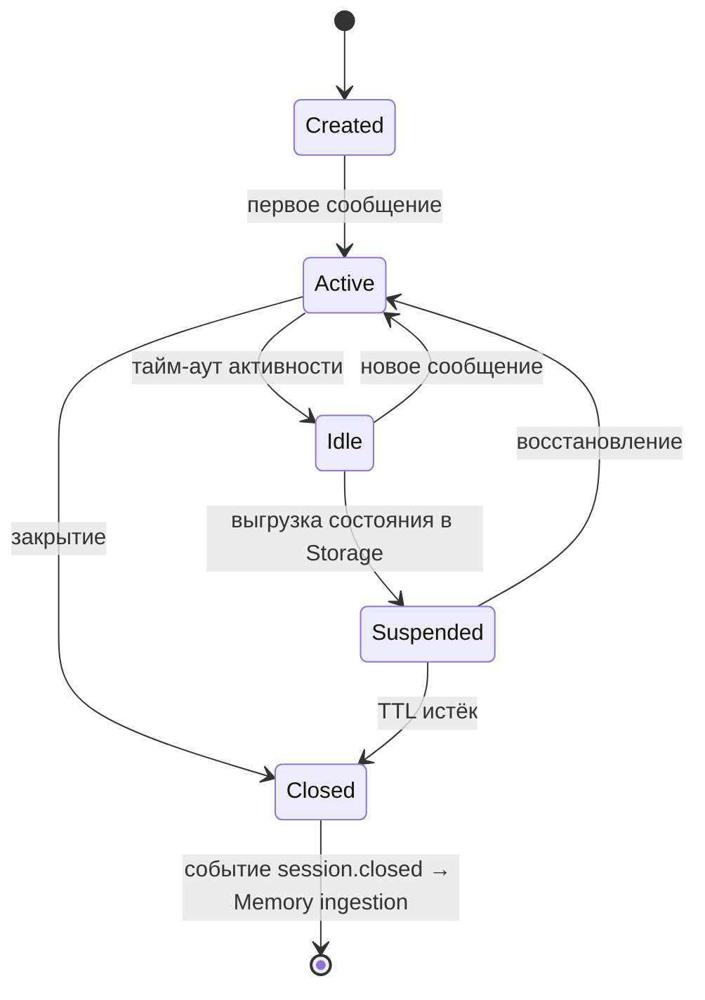
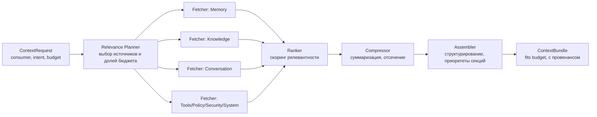
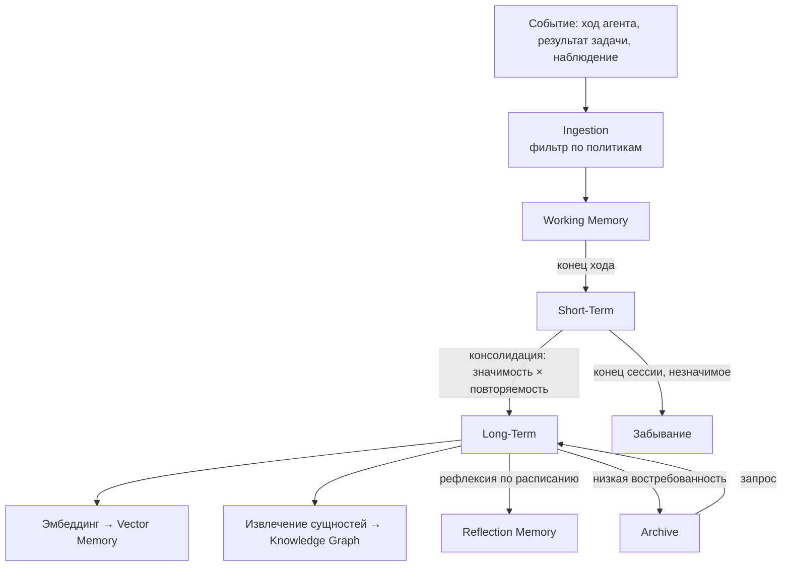
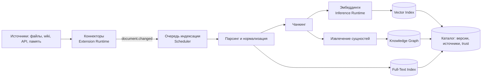

# 02 — Когнитивный слой: Session, Context, Memory, Knowledge

## 1. Session Runtime

**Ответственность:** жизненный цикл сессий — устойчивых границ
взаимодействия пользователя (или внешней системы) с платформой.

Сессия владеет: идентичностью участника, привязанными агентами,
Conversation Context, лимитами (Resource Runtime), настройками политик.

Порты: `SessionPort` (open, attach, suspend, resume, close).
События: `session.opened`, `session.suspended`, `session.closed`.

Сессии сериализуемы: Suspended-сессия — это запись в Storage, что даёт
переживание рестартов и миграцию между узлами кластера.

---

## 2. Context Runtime

**Ответственность:** автоматическая сборка контекста для любого
потребителя (агента, workflow, инференс-запроса) под заданный бюджет.

### 2.1 Виды контекста

| Вид | Источник | Содержание |
|---|---|---|
| Active Context | Session | Текущая задача, фокус внимания, последние ходы |
| Conversation Context | Session | История диалога (сжатая по мере роста) |
| Memory Context | Memory Runtime | Релевантные воспоминания всех уровней |
| Knowledge Context | Knowledge Runtime | Фрагменты знаний (RAG), узлы графа |
| Semantic Context | Memory/Knowledge | Семантически близкие сущности к текущему фокусу |
| Tool Context | Tool Runtime | Доступные инструменты, их схемы и состояние |
| Workflow Context | Workflow Runtime | Текущий шаг, переменные, история исполнения |
| Security Context | Security Runtime | Идентичность, разрешения, уровень доверия |
| Policy Context | Policy Runtime | Действующие ограничения и правила |
| System Context | Configuration/Resource | Версия платформы, лимиты, окружение |

### 2.2 Конвейер сборки

Runtime **сам определяет**, какие части контекста необходимы: решение
принимает Relevance Planner на основе типа запроса, истории и политик.

- **Budget-aware:** бюджет (в токенах) задаёт Resource Runtime; Planner
  распределяет его по источникам, Compressor гарантирует соблюдение.
- **Провенанс:** каждый фрагмент несёт ссылку на источник и trust level —
  это основа объяснимости и аудита.
- **Кэширование:** стабильные секции (System, Tool schemas) кэшируются и
  переиспользуются между запросами (prompt-cache friendly).

Порт: `ContextPort.build(request): ContextBundle`.
События: `context.built` (с метриками состава — для Observability).

---

## 3. Memory Runtime

**Ответственность:** многоуровневая память и жизненный цикл данных в ней.

### 3.1 Уровни памяти

| Уровень | Хранение | TTL | Назначение |
|---|---|---|---|
| Working Memory | RAM (актор) | ход/задача | Текущее рассуждение, scratchpad |
| Short-Term Memory | RAM + KV | сессия | Недавние ходы, промежуточные факты |
| Long-Term Memory | KV/реляционное | месяцы—годы | Консолидированные факты, предпочтения |
| Semantic Memory | Vector + граф | долговременно | Обобщённые понятия и связи |
| Vector Memory | Vector store | долговременно | Эмбеддинги всех уровней для поиска |
| Episodic Memory | Реляционное | долговременно | «Что происходило»: эпизоды с временем и участниками |
| Procedural Memory | KV/документы | долговременно | «Как делать»: выученные процедуры, удачные планы |
| Reflection Memory | Документы | долговременно | Выводы саморефлексии: ошибки, уроки, оценки |
| Knowledge Graph | Graph store | долговременно | Сущности и отношения (совместно с Knowledge Runtime) |
| Archive | Object storage | неограниченно | Холодные данные, вытесненные с верхних уровней |

### 3.2 Жизненный цикл данных

Ключевые процессы (фоновые, через Scheduler Runtime):

1. **Consolidation** — периодический перенос значимого из Short-Term в
   Long-Term с суммаризацией; критерии: значимость, повторяемость,
   явные указания («запомни»), политики.
2. **Reflection** — генерация выводов из эпизодов (использует Inference
   Runtime): уроки, паттерны ошибок, обновление Procedural Memory.
3. **Forgetting/Decay** — оценка востребованности; вытеснение в Archive
   или удаление; правом на удаление управляет Policy Runtime (retention).
4. **Re-indexing** — обновление эмбеддингов при смене модели эмбеддингов
   (версия модели хранится с каждым вектором).

Порты: `MemoryPort` (remember, recall(query, levels, k), forget),
`MemoryAdminPort` (consolidate, reindex, export).
События: `memory.item.stored`, `memory.item.promoted`,
`memory.item.archived`, `memory.reflection.created`.

Память **мультиарендна**: каждый item несёт scope (user / agent / team /
global), изоляцию scope’ов обеспечивает Policy + Security.

---

## 4. Knowledge Runtime

**Ответственность:** управляемые знания — в отличие от памяти
(субъективный опыт агентов), знания — курируемый, версионируемый корпус.

### 4.1 Возможности

- **Knowledge Bases** — именованные коллекции с владельцами и политиками
  доступа.
- **Document Indexes** — конвейер: загрузка → парсинг → чанкинг →
  эмбеддинги → индекс. **Automatic Indexing**: watcher-коннекторы
  (файловые системы, wiki, репозитории) публикуют события изменений,
  индексация — инкрементальная.
- **Embeddings** — через Model Runtime (модель эмбеддингов — тоже
  сменяемый модуль); версия модели фиксируется в индексе.
- **Knowledge Graph** — сущности/отношения, извлекаемые из документов и
  памяти; поддерживает многошаговые запросы (graph traversal) для
  сложных вопросов.
- **Semantic Search** — гибридный поиск: векторный + полнотекстовый +
  графовый, с re-ranking.
- **RAG** — порт `KnowledgePort.retrieve(query, options)` возвращает
  фрагменты с провенансом; сборку в промпт выполняет Context Runtime.
- **Versioning** — KB версионируются снапшотами; запрос может выполняться
  против конкретной версии (воспроизводимость).
- **Source Tracking** — каждый чанк несёт: источник, автора, дату,
  версию документа, метод извлечения.
- **Trust Levels** — уровень доверия источника (verified / internal /
  external / unverified); влияет на ранжирование и обязателен в
  провенансе ответов.

### 4.2 Конвейер индексации

События: `knowledge.document.indexed`, `knowledge.base.versioned`,
`knowledge.entity.linked`.

## 5. Анализ слоя

- **Масштабируемость:** индексация и консолидация — фоновые,
  горизонтально масштабируемые воркеры; хранилища — за Storage Runtime,
  который абстрагирует шардирование.
- **Безопасность:** scope-изоляция памяти; trust levels и провенанс
  защищают от отравления знаний (prompt/data poisoning); retention —
  политиками.
- **Расширяемость:** новые уровни памяти, стратегии чанкинга, re-rankers
  и коннекторы — плагины; смена векторной БД — замена адаптера Storage.
