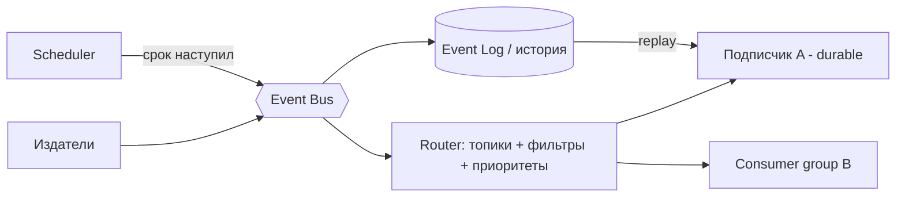
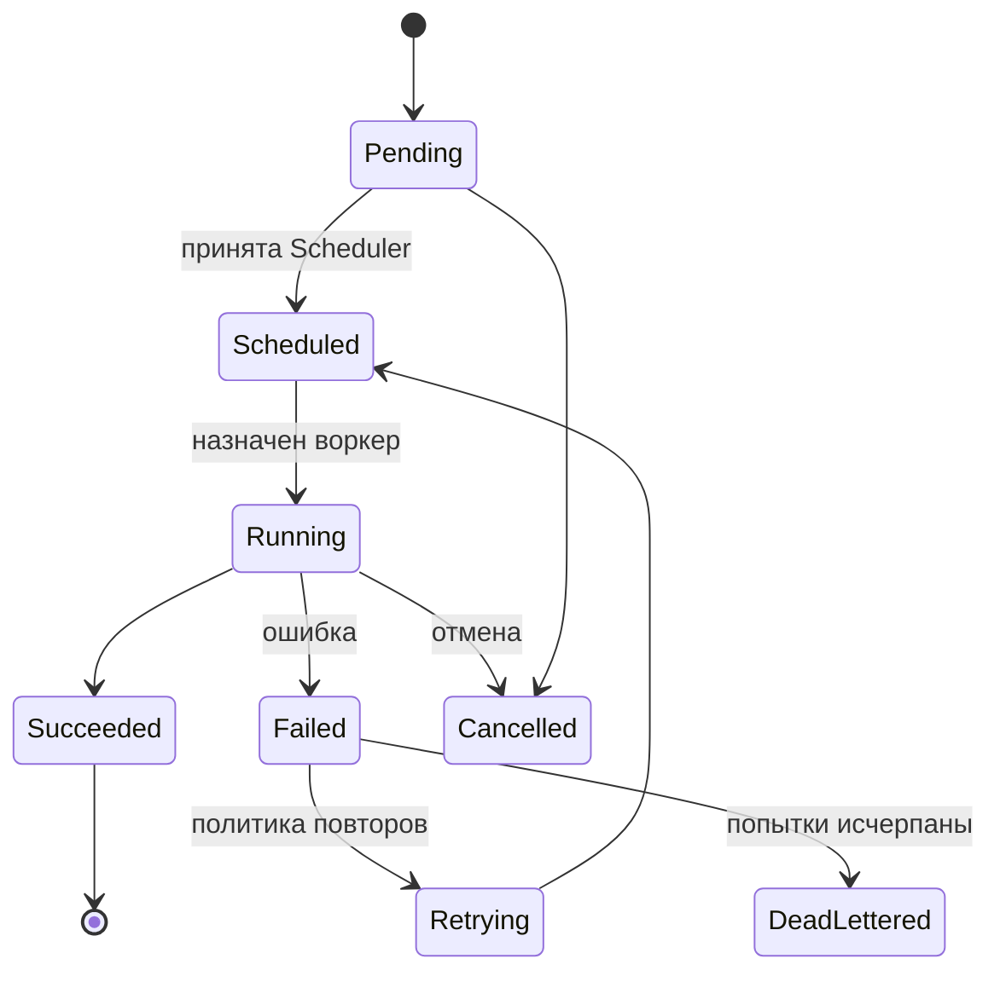
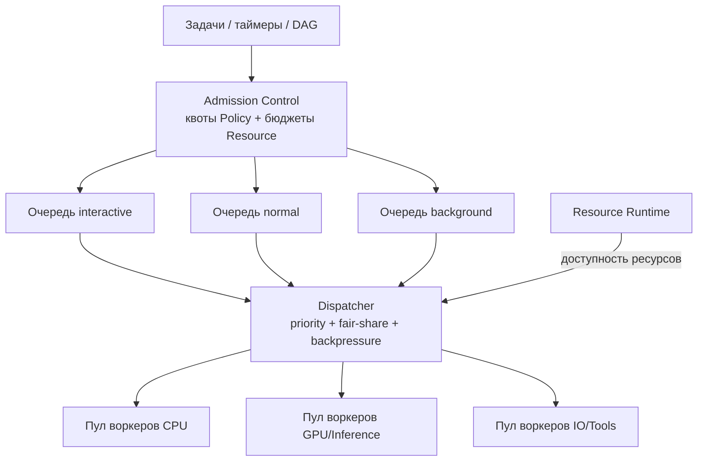

# 03 — Слой исполнения: Task, Workflow, Scheduler, Event

## 1. Event Runtime

**Ответственность:** вся платформа взаимодействует исключительно через
события — Event Runtime реализует семантику шины поверх Message Router
ядра.

### 1.1 Возможности

| Возможность | Реализация |
|---|---|
| Публикация | `publish(event, opts)` — типизированные события со схемой и версией |
| Подписка | Durable/ephemeral подписки; consumer groups для конкуренции |
| Маршрутизация | Топики `domain.entity.action` + content-based фильтры |
| Приоритеты | Очереди по классам QoS: `interactive` > `normal` > `background` |
| Отложенные события | `publishAt(event, time)` — хранятся в Scheduler, публикуются по сроку |
| История событий | Append-only Event Log с ретенцией по политикам; replay для восстановления и отладки |

### 1.2 Контракт события

```yaml
event:
  id: uuid
  type: task.completed        # domain.entity.action
  version: 1                  # semver major схемы payload
  time: RFC3339
  source: task-runtime/node-3
  subject: task:abc123        # сущность-предмет
  correlationId: ...          # сквозная трасса
  causationId: ...            # событие-причина
  priority: normal
  payload: { ...по схеме... }
```

Гарантии: **at-least-once** доставка, порядок в пределах subject,
идемпотентность обработчиков обязательна (dedup по `id`).
Схемы событий регистрируются в Schema Registry (часть Event Runtime),
несовместимые изменения требуют новой major-версии.



---

## 2. Task Runtime

**Ответственность:** атомарная единица работы — задача.

Задача = типизированный запрос + исполнитель (агент, инструмент, функция)
+ политика повторов + результат.



Свойства: идемпотентный ключ, тайм-аут, приоритет, зависимость от
ресурсов (через Resource Runtime), lease-механизм (воркер продлевает
аренду; смерть воркера → задача возвращается в очередь).

Порт: `TaskPort` (submit, cancel, get, await).
События: `task.submitted`, `task.started`, `task.completed`,
`task.failed`, `task.deadlettered`.

---

## 3. Workflow Runtime

**Ответственность:** оркестрация многошаговых процессов.

### 3.1 Модель

Workflow — декларативный граф шагов (DSL: YAML/JSON + SDK-биндинги),
исполняемый durable-интерпретатором: состояние каждого экземпляра
персистентно (event sourcing по шагам), исполнение переживает рестарты.

Поддерживаемые конструкции:

| Конструкция | Описание |
|---|---|
| Sequence | Последовательные шаги |
| Branch | Ветвление по условию (выражения над переменными контекста) |
| Loop | Циклы: for-each, while, с лимитом итераций |
| Condition | Guard-условия на любом шаге |
| Event wait | Ожидание события (`wait_for: event.type`, с тайм-аутом) |
| Delay/Timer | Ожидание времени (через Scheduler) |
| Parallel | Параллельные ветви + join (all / any / N-of-M) |
| Compensation | Saga: у шага — компенсирующее действие; при сбое выполняются компенсации выполненных шагов в обратном порядке |
| Sub-workflow | Вложенные workflow, переиспользование |
| Human-in-the-loop | Шаг ожидания решения человека (через API Runtime) |

### 3.2 Пример определения

```yaml
workflow: research-and-report@1
steps:
  - id: gather
    type: parallel
    branches:
      - task: { type: web.search, input: "$.query" }
      - task: { type: knowledge.retrieve, input: "$.query" }
    join: all
  - id: analyze
    agent: analyst
    input: "$.gather.results"
    compensation: { task: { type: report.discard } }
  - id: approve
    type: wait_event
    event: report.approved
    timeout: 24h
    on_timeout: { goto: escalate }
  - id: publish
    task: { type: report.publish }
```

Шаги исполняются как задачи Task Runtime; Workflow Runtime лишь
управляет состоянием и порядком — разделение ответственности.

События: `workflow.started`, `workflow.step.completed`,
`workflow.compensated`, `workflow.completed`, `workflow.failed`.

---

## 4. Scheduler Runtime

**Ответственность:** когда и где исполняется работа.

Управляет:

- **процессами** — размещение акторов/воркеров по узлам (в кластере);
- **агентами** — квоты одновременных активаций, fair-share между
  сессиями;
- **таймерами** — cron-расписания и одноразовые таймеры (durable, с
  персистентностью);
- **очередями** — очереди задач по классам приоритета и пулам ресурсов;
- **фоновыми задачами** — консолидация памяти, индексация, рефлексия —
  в окна низкой нагрузки;
- **зависимостями** — DAG задач: задача стартует, когда завершены
  зависимости и доступны ресурсы.



Ключевые механизмы: backpressure (очереди ограничены, издатели
замедляются), starvation-защита (aging приоритетов), lease + heartbeat
для воркеров, в кластере — шардирование очередей и выбор лидера для
таймеров.

## 5. Анализ слоя

- **Масштабируемость:** очереди и воркеры масштабируются горизонтально;
  durable workflow позволяет пережить рестарты и миграции; Event Log —
  источник истины для восстановления.
- **Безопасность:** admission control проверяет политики до постановки в
  очередь; события несут security-контекст инициатора; история событий —
  часть аудита.
- **Расширяемость:** новые типы шагов workflow, стратегии диспетчеризации
  и транспорты шины — плагины; DSL расширяется без изменения движка
  (шаг = задача зарегистрированного типа).
