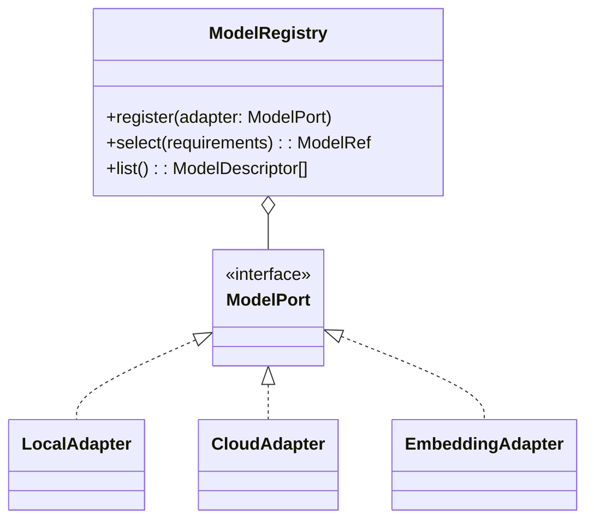
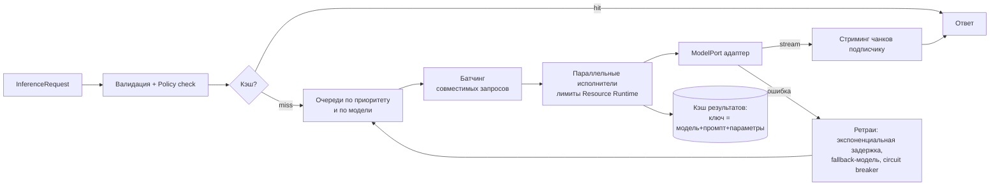
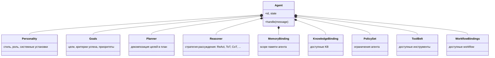
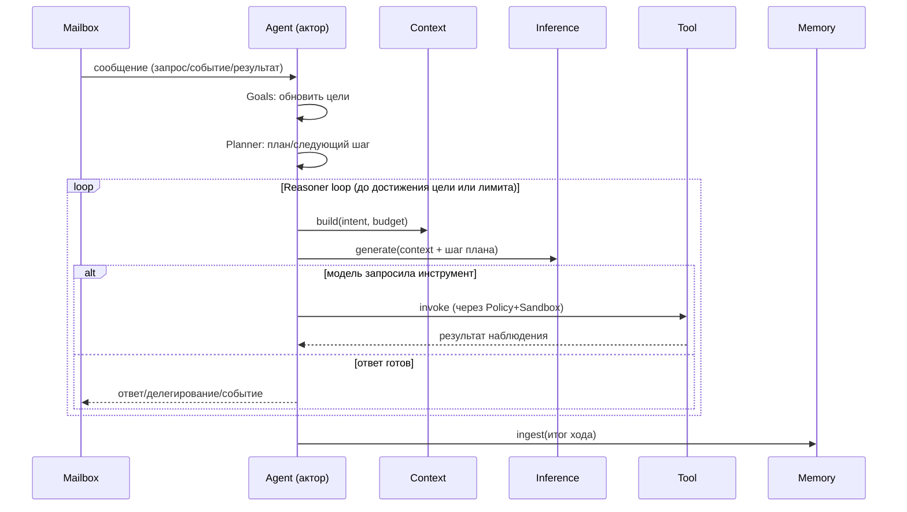
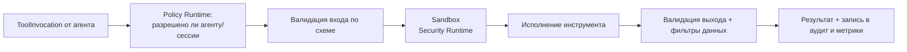

# 04 — Слой интеллекта: Agent, Model, Inference, Tool

## 1. Model Runtime

**Ответственность:** реестр моделей и единый интерфейс к любому
провайдеру. Добавление новой модели **не требует изменения архитектуры**
— только регистрации адаптера-плагина.

### 1.1 Единый порт

```
interface ModelPort {
  descriptor(): ModelDescriptor      // возможности, лимиты, стоимость
  generate(req: GenerateRequest): AsyncStream<GenerateChunk>
  embed(req: EmbedRequest): EmbedResponse
  health(): HealthStatus
}
```

`ModelDescriptor` декларирует capabilities: `text`, `vision`, `audio`,
`tools`, `json-mode`, `context-window`, `max-output`, `cost-per-token`,
`locality: local|cloud`, `modalities`. Потребители запрашивают модель
**по требованиям**, а не по имени:

```
ModelRegistry.select({ capabilities: [tools, vision],
                       minContext: 100k, prefer: cheapest })
```

### 1.2 Классы адаптеров

| Класс | Примеры реализации адаптера |
|---|---|
| Локальные | llama.cpp, vLLM, ONNX Runtime, MLX |
| Облачные | Anthropic, OpenAI-совместимые, Google, Bedrock |
| Мультимодальные | vision/audio-модели за тем же портом (capabilities) |
| Специализированные | эмбеддинги, re-rankers, классификаторы, code-модели |

Реестр поддерживает: версии моделей, алиасы (`default-chat`,
`default-embed`), политики выбора (Policy Runtime может запретить
облачные модели для чувствительных данных), fallback-цепочки.



---

## 2. Inference Runtime

**Ответственность:** исполнение запросов к моделям как управляемый
конвейер. Отделён от Model Runtime: Model — «что вызывать», Inference —
«как исполнять надёжно и эффективно».



Возможности:

- **Очереди** — по приоритету QoS и по целевой модели; admission через
  Resource Runtime (token budget, VRAM).
- **Стриминг** — чанки транслируются потребителю через события/поток
  порта; отменяемость (cancel пробрасывается до адаптера).
- **Батчинг** — динамический (окно по времени/размеру) для локальных
  моделей и эмбеддингов.
- **Параллельное выполнение** — пул исполнителей на модель; лимиты
  конкурентности из дескриптора модели и квот.
- **Ограничение ресурсов** — токен-бюджеты на сессию/агента/арендатора;
  rate limits провайдеров соблюдаются централизованно.
- **Повторные попытки** — ретраи с джиттером, circuit breaker на
  провайдера, fallback на резервную модель по политике.
- **Кэширование** — точное (детерминированные запросы) и семантическое
  (опционально, по близости эмбеддинга) с явной пометкой в провенансе.

События: `inference.requested`, `inference.completed` (с latency,
токенами, стоимостью — источник метрик и биллинга), `inference.failed`.

---

## 3. Agent Runtime

**Ответственность:** композиция и исполнение агентов.

### 3.1 Агент как композиция

Любой агент состоит из независимых, заменяемых компонентов:



Определение агента — декларативный манифест (`agent.yaml`): каждый
компонент — ссылка на реализацию из реестра (планировщики и стратегии
рассуждения — плагины). Один и тот же Planner можно заменить, не трогая
остальное.

### 3.2 Агент как актор

Исполнение — по Actor Model: у каждого экземпляра агента — почтовый ящик,
последовательная обработка сообщений, изолированное состояние,
supervision (перезапуск при сбое, состояние восстанавливается из
персистентного снапшота + Event Log). Это даёт: отсутствие гонок,
локальность состояния, прозрачное шардирование по узлам кластера.

### 3.3 Цикл хода агента



Мультиагентность: агенты обмениваются сообщениями через Event Runtime
(адресно или по топикам), делегируют подзадачи через Task Runtime,
координируются через Workflow Runtime. Специальных «оркестраторов» в
ядре нет — оркестратор — это тоже агент или workflow.

События: `agent.spawned`, `agent.turn.completed`, `agent.delegated`,
`agent.failed`.

---

## 4. Tool Runtime

**Ответственность:** инструменты как управляемые сервисы.

### 4.1 Манифест инструмента

```yaml
tool:
  id: web.search
  version: 2.1.0
  description: "Поиск в вебе с фильтрами"
  input_schema: { ...JSON Schema... }
  output_schema: { ...JSON Schema... }
  permissions:            # что нужно инструменту
    - network:egress:https
  policy:                 # политика безопасности исполнения
    sandbox: process       # none | thread | process | container
    timeout: 30s
    rate_limit: 60/min
    data_classes: [public] # какие классы данных допустимо передавать
  dependencies: [http-client@^3]
  state: stateless         # stateless | session | persistent
  metrics: [latency, error_rate, invocations]
```

### 4.2 Исполнение



- Каждый вызов проходит: проверку прав → валидацию → sandbox →
  валидацию результата → аудит.
- Версионирование: несколько версий инструмента сосуществуют; агент
  привязывается к диапазону версий.
- Состояние: session-инструменты (например, браузер) получают
  изолированное состояние на сессию, управляемое Tool Runtime.
- Реестр инструментов отдаёт Tool Context (схемы для модели) в Context
  Runtime; описания оптимизируются под токен-бюджет.
- Инструменты поставляются как плагины/расширения; поддерживаются
  адаптеры внешних каталогов инструментов (MCP-класс протоколов) через
  Extension Runtime.

События: `tool.invoked`, `tool.completed`, `tool.denied`, `tool.failed`.

## 5. Анализ слоя

- **Масштабируемость:** Inference — независимо масштабируемый пул;
  агенты шардируются как акторы; инструменты — stateless-сервисы, где
  возможно.
- **Безопасность:** инструменты — главная поверхность атаки; каждый
  вызов проходит политику + sandbox + аудит; выходы моделей считаются
  недоверенными данными.
- **Расширяемость:** модель, стратегия рассуждения, планировщик,
  инструмент — всё добавляется адаптером/плагином без изменения ядра слоя.
