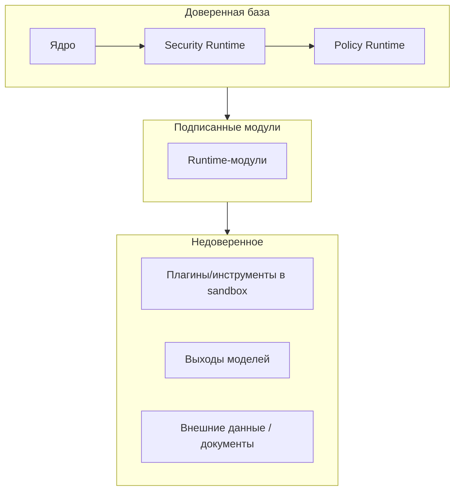
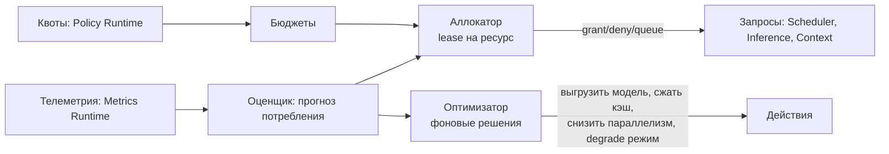

# 05 — Слой управления: Policy, Security, Resource

## 1. Policy Runtime

**Ответственность:** единая декларативная система политик. Все остальные
Runtime **спрашивают** Policy Runtime; сами политики нигде больше не
зашиты.

### 1.1 Модель политики

Политика = правило `(subject, action, resource, condition) → effect`
с приоритетом и областью действия (global / tenant / session / agent).

```yaml
policy:
  id: no-cloud-models-for-pii
  scope: tenant:acme
  priority: 100
  rule:
    subject: { any: true }
    action: inference.generate
    resource: { model.locality: cloud }
    condition: context.data_classes contains "pii"
  effect: deny
  message: "PII разрешено обрабатывать только локальными моделями"
```

### 1.2 Домены применения

| Домен | Примеры решений |
|---|---|
| Безопасность | Какие инструменты требуют подтверждения человека |
| Доступ | Кто видит какие сессии, KB, память |
| Ресурсы | Квоты токенов/CPU/стоимости на агента/сессию/арендатора |
| Модели | Разрешённые провайдеры, маршрутизация по чувствительности данных |
| Память | Retention, что можно консолидировать, право на забвение |
| Контекст | Какие источники допустимы в контекст для данного запроса |
| Агенты | Лимиты автономии: глубина делегирования, бюджет действий |
| Инструменты | Allow/deny-списки, лимиты частоты, классы данных |

### 1.3 Исполнение

PDP/PEP-модель: Policy Runtime — Decision Point
(`PolicyPort.evaluate(request): Decision {allow|deny|allow_with_obligations}`),
каждый Runtime содержит Enforcement Point (перехватчик на границе порта).
Решения кэшируются с инвалидацией по событию `policy.changed`.
Obligations — предписания («замаскировать поля», «залогировать в аудит»,
«запросить подтверждение»), которые PEP обязан исполнить.

Политики версионируются, проходят валидацию и dry-run (оценка влияния на
исторических решениях из Event Log) до активации.

---

## 2. Security Runtime

**Ответственность:** механизмы безопасности (Policy решает «что можно»,
Security обеспечивает «как это гарантировать»).

### 2.1 Компоненты

| Компонент | Содержание |
|---|---|
| Sandbox | Изолированное исполнение инструментов и плагинов: уровни none/thread/process/container/microVM; ограничение файловой системы, сети, syscalls |
| Permissions | Capability-модель: модуль/плагин/агент получает явный набор способностей (`storage:kv:read`, `network:egress:host:*.example.com`); по умолчанию — ничего |
| Secrets | Хранилище секретов с шифрованием at-rest, выдача по короткоживущим lease, секреты не попадают в контекст моделей и логи (редакция) |
| Credentials | Идентичности пользователей/агентов/сервисов; интеграция с внешними IdP (OIDC) через адаптеры; mTLS между узлами кластера |
| Audit Logs | Append-only журнал: каждое решение политики, вызов инструмента, доступ к памяти/знаниям, административное действие; криптографическое сцепление записей |
| Plugin Isolation | Плагины исполняются в sandbox с манифестными permissions; подпись и верификация пакетов плагинов |
| Runtime Policies | Enforcement на границах: входы/выходы моделей — недоверенные данные; фильтры инъекций промптов; DLP-фильтры на выходах |
| Threat Detection | Подписчик Event Log: аномалии частоты вызовов, эскалация привилегий, нетипичные цепочки действий агентов → события `security.threat.detected` → автоматические obligations (заморозка агента, требование подтверждения) |

### 2.2 Модель доверия



Принципы: least privilege, deny by default, полный аудит, недоверие к
выходам моделей и внешнему контенту (инструкции из документов не
исполняются без политики, разрешающей это явно).

---

## 3. Resource Runtime

**Ответственность:** интеллектуальное управление ресурсами; Runtime
самостоятельно оптимизирует их использование.

### 3.1 Контролируемые ресурсы

| Ресурс | Механизмы |
|---|---|
| CPU | Пулы воркеров, квоты на модуль/арендатора |
| GPU / VRAM | Планирование размещения моделей, выгрузка неиспользуемых, очереди на устройство |
| RAM | Лимиты кэшей и Working Memory, вытеснение в Storage |
| Storage | Квоты, ретенция, tiering (hot/warm/cold → Archive) |
| Network | Rate limits на исходящие вызовы провайдеров и инструментов |
| Context Window | Бюджеты контекста на запрос (выдаются Context Runtime) |
| Token Budget | Бюджеты токенов/стоимости на сессию/агента/арендатора/период |

### 3.2 Механика



- **Lease-модель:** потребитель получает аренду ресурса с TTL;
  невозобновлённая аренда освобождается.
- **Оптимизатор:** периодически принимает решения: подгрузка/выгрузка
  локальных моделей по спросу, переключение fallback-цепочек при
  исчерпании бюджета, деградация (меньшая модель, сжатый контекст) по
  политике вместо отказа.
- **Учёт стоимости:** каждый inference-вызов тарифицируется; бюджеты
  «в деньгах» — первоклассный ресурс.

События: `resource.granted`, `resource.exhausted`,
`resource.optimization.applied`, `budget.threshold.crossed`.

## 4. Анализ слоя

- **Масштабируемость:** PDP реплицируется с кэшем решений; аллокатор
  ресурсов шардируется по пулам/узлам; аудит — партиционированный
  append-only поток.
- **Безопасность:** слой сам является гарантом; его модули входят в
  минимальную доверенную базу вместе с ядром.
- **Расширяемость:** новые типы ресурсов, детекторы угроз, sandbox-
  бэкенды и языки политик — адаптеры; политики — данные, а не код.
