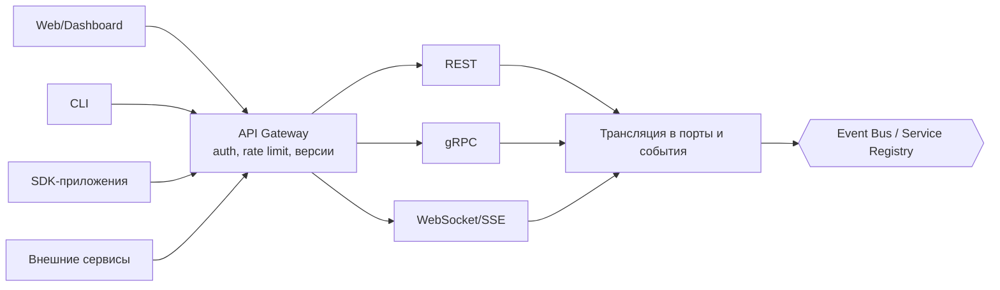

# 07 — Интерфейсный слой: API, Plugin, Extension, Dashboard

## 1. API Runtime

**Ответственность:** все внешние протоколы доступа к платформе.
API Runtime — тонкий слой: транслирует протоколы в порты/события, не
содержит бизнес-логики.

### 1.1 Поверхности

| Поверхность | Назначение |
|---|---|
| REST | CRUD-операции: сессии, агенты, KB, конфигурация, политики; OpenAPI-спецификация — источник истины |
| gRPC | Межсервисное и высокопроизводительное взаимодействие; protobuf-контракты генерируются из тех же схем |
| WebSocket | Двунаправленные сессии: диалог с агентом, подписка на события |
| Streaming | SSE/gRPC-stream для потоковых ответов инференса и прогресса workflow |
| CLI | Администрирование и скриптинг: `agentos agents list`, `agentos kb index ./docs` |
| SDK | Python SDK, JavaScript/TypeScript SDK — генерируются из контрактов + идиоматические обёртки (async, типизация) |
| Plugin SDK | Каркас разработки плагинов: манифесты, тестовый harness, локальный запуск в sandbox |

### 1.2 Сквозные механизмы

- **API First:** контракты (OpenAPI/protobuf/AsyncAPI для событий)
  версионируются в репозитории раньше реализации; SDK и документация
  генерируются из них.
- AuthN/AuthZ на границе: токены → Security Runtime; каждое действие —
  через Policy.
- Версионирование API: `/v1`, deprecation-политика, совместимость в
  пределах major.
- Rate limiting и квоты — через Resource Runtime.
- Единая модель ошибок: код, категория (retryable/terminal), traceId.

## 2. Plugin Runtime

**Ответственность:** жизненный цикл плагинов — устанавливаемых пакетов
стороннего кода.

- **Пакет плагина:** манифест (id, версия, точки расширения, permissions,
  подпись) + артефакты (код/бинарь/wasm).
- **Жизненный цикл:** discover → verify (подпись, совместимость версий
  API) → approve permissions (человек или политика) → install →
  activate (в sandbox) → upgrade/rollback → deactivate → uninstall.
- **Изоляция:** плагин исполняется в sandbox Security Runtime; общается
  с платформой только через Plugin API (стабильное подмножество портов,
  выданное по permissions). Крэш плагина не затрагивает платформу
  (supervision, circuit breaker).
- **Реестры:** локальный каталог + внешние registry-адаптеры; pinning
  версий, воспроизводимые установки.

## 3. Extension Runtime

**Ответственность:** система точек расширения. «Любая возможность
платформы добавляется как расширение» — Extension Runtime определяет,
куда именно подключаются плагины.

### 3.1 Типы расширений и точки подключения

| Тип | Точка расширения | Примеры |
|---|---|---|
| Драйверы моделей | `ModelPort` | новый провайдер LLM, локальный рантайм |
| Инструменты | `ToolManifest` | поиск, браузер, исполнение кода |
| Адаптеры хранилищ | `*StorePort` | новая векторная БД |
| Коннекторы | `KnowledgeConnector`, `EventConnector` | wiki, репозитории, почта, MCP-серверы |
| Стратегии | `PlannerPort`, `ReasonerPort`, `ChunkerPort`, `RankerPort` | новые алгоритмы планирования/чанкинга |
| Политики | `PolicyLanguagePort`, детекторы угроз | новый policy-движок |
| Каналы | `AlertChannelPort`, экспортёры метрик | Slack-алерты, OTLP |
| UI-модули | Dashboard extension points | новая панель в Dashboard |
| Внешние сервисы | `ServiceProxyPort` | обёртки внешних API как сервисы платформы |

Каждая точка расширения — версионированный интерфейс из `contracts/*`;
реестр точек расширения публичен и является частью Plugin SDK.
Модули платформы сами потребляют собственные точки расширения
(dogfooding): встроенные инструменты и адаптеры устроены так же, как
сторонние.

## 4. Runtime Dashboard

**Ответственность:** панель управления платформой (веб-приложение поверх
API Runtime; собственной логики не имеет).

### 4.1 Разделы

| Раздел | Содержание |
|---|---|
| Models | Реестр моделей, capabilities, health, стоимость, маршрутизация и fallback-цепочки |
| Agents | Определения и живые экземпляры, состояние акторов, текущие ходы, лимиты автономии |
| Sessions | Активные/приостановленные сессии, участники, привязанные агенты |
| Memory | Просмотр уровней памяти по scope, поиск, ручное редактирование/забвение (по правам) |
| Knowledge | KB, статусы индексации, версии, источники, trust levels |
| Knowledge Graph | Визуализация графа: сущности, связи, провенанс |
| Events | Живой поток событий, фильтры, история, replay |
| Workflows | Определения, живые экземпляры, шаг/состояние, компенсации, ручное вмешательство |
| Scheduler | Очереди, глубины, таймеры, DAG зависимостей, фоновые задачи |
| Plugins | Установленные плагины, permissions, версии, здоровье, установка/откат |
| Metrics | Дашборды: latency, токены, стоимость, hit-rate кэшей, по арендаторам |
| Resources | Бюджеты и потребление: GPU/VRAM/токены/деньги; действия оптимизатора |
| Logs | Поиск по структурированным логам, привязка к трассам |
| Diagnostics | Health-карта модулей, автопроверки, инцидент-паки, replay-отладка |
| Security | Аудит-журнал, активные угрозы, permissions, секреты (метаданные) |
| Policies | Просмотр/редактирование политик, dry-run, история изменений |
| Configuration | Конфигурация модулей, hot-reload, профили окружений |

### 4.2 Принципы UI

- Живые данные — по WebSocket-подписке на события (Dashboard — обычный
  подписчик шины).
- Каждое действие в UI — вызов публичного API (никаких приватных
  каналов) — паритет CLI/SDK/UI.
- Разделы подключаемы как UI-расширения; права на разделы — через Policy.

## 5. Анализ слоя

- **Масштабируемость:** API Runtime — stateless, горизонтально
  масштабируется за балансировщиком; WebSocket-сессии — sticky либо через
  шину.
- **Безопасность:** единственная точка входа снаружи; строгая
  аутентификация, все действия аудируются; плагины — подписаны и
  изолированы.
- **Расширяемость:** сам слой и есть механизм расширяемости; новые
  протоколы (например, новый агентский протокол) — адаптеры API Runtime.
