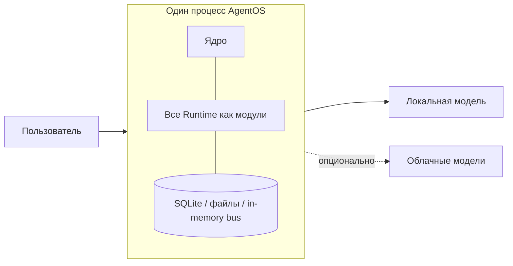
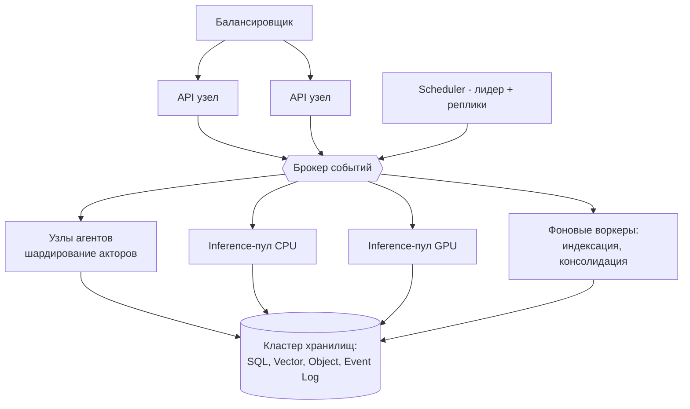

# 08 — Масштабируемость и режимы развёртывания

## 1. Требуемые режимы

Архитектура поддерживает без изменения контрактов:

1. однопользовательский режим (одна машина, встроенные хранилища);
2. несколько пользователей;
3. несколько моделей;
4. несколько агентов;
5. несколько серверов;
6. кластер;
7. распределённое выполнение;
8. облачное развёртывание.

Ключ к этому — три решения, принятые на уровне архитектуры:

- **Взаимодействие только через порты и события** → размещение модуля
  (in-process / отдельный процесс / другой узел) — деталь транспорта.
- **Акторная модель для агентов и задач** → состояние локально,
  шардируется по ключу (agentId/sessionId), мигрирует между узлами.
- **Durable-состояние в Storage + Event Log** → любой узел взаимозаменяем,
  восстановление — из снапшота + replay.

## 2. Топологии

### T1 — Single-user / Edge (Modular Monolith)

Один процесс. Встроенные адаптеры: SQLite, файлы, in-memory шина,
локальные модели. Ноль внешних зависимостей.

### T2 — Team / Single Server

Тот же монолит + внешние PostgreSQL/Redis/векторная БД, несколько
воркеров инференса. Мультипользовательность включается конфигурацией
(идентичности, scope-ы памяти, квоты).

### T3 — Distributed (несколько серверов)

Тяжёлые Runtime выносятся в свои сервисы; шина — брокер.

### T4 — Cloud / Multi-tenant кластер

T3 + автоскейлинг пулов по метрикам очередей, мультиарендность
(namespace-ы во всех хранилищах, квоты и биллинг per-tenant),
георепликация Event Log и хранилищ, изоляция арендаторов вплоть до
выделенных inference-пулов.

## 3. Измерения масштабирования

| Измерение | Механизм |
|---|---|
| Пользователи/сессии | Stateless API-узлы; сессии — durable, восстанавливаются на любом узле |
| Агенты | Шардирование акторов по consistent hashing; supervision и миграция при отказе узла |
| Модели | Реестр не ограничен; локальные модели — planner размещения по GPU; облачные — пулы соединений и rate-limit центрально |
| Инференс | Независимые пулы по классам моделей; автоскейлинг по глубине очереди |
| Знания | Индексация — параллельные воркеры; индексы — шардируемые за Storage-портами |
| События | Партиционирование топиков по subject; consumer groups |
| Scheduler | Лидер-выборы для таймеров; очереди партиционированы |

## 4. Отказоустойчивость

- Уровни: retry (Inference/Task) → circuit breaker (провайдеры) →
  supervision (акторы) → рестарт модуля (ядро) → переезд шарда (кластер).
- Восстановление состояния: снапшоты акторов/workflow + replay Event Log.
- Деградация вместо отказа: Resource Runtime переключает на меньшие
  модели/сжатый контекст по политике при исчерпании ресурсов.
- Все обработчики идемпотентны (at-least-once доставка).

## 5. Рекомендации

1. Начинать с T1/T2; переход выше — изменением конфигурации транспортов
   и хранилищ, не кода.
2. Первым выносить Inference Runtime (самый несбалансированный по
   ресурсам), затем индексацию Knowledge.
3. Event Log с самого начала держать durable — он же аудит и replay.
4. Нагрузочное тестирование по профилям: interactive latency (p99 хода
   агента), throughput фона (индексация), burst (мультиагентные вспышки).
5. Бюджетировать context-window и токены как ресурсы первого класса —
   они исчерпываются раньше CPU.
